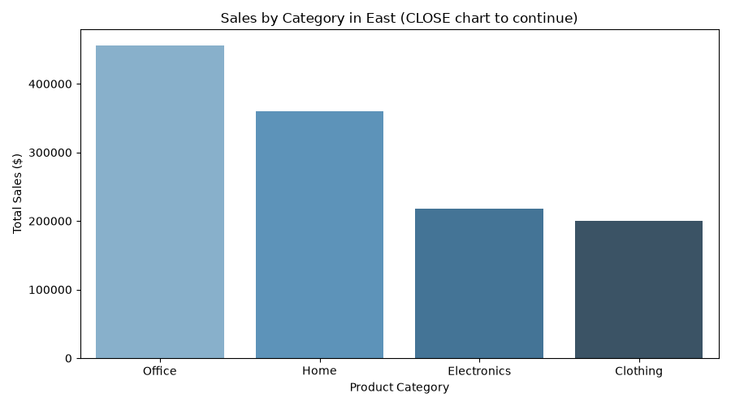
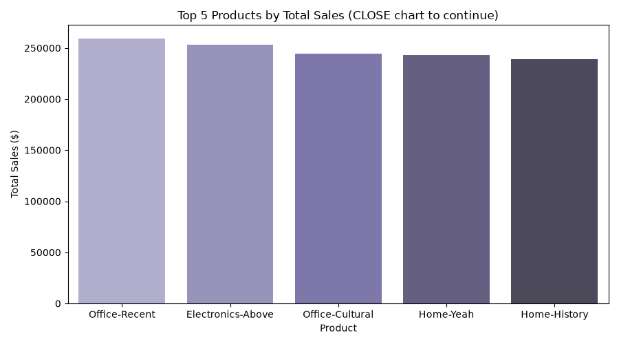
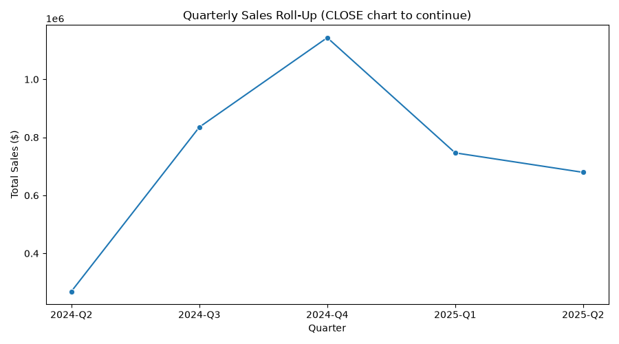
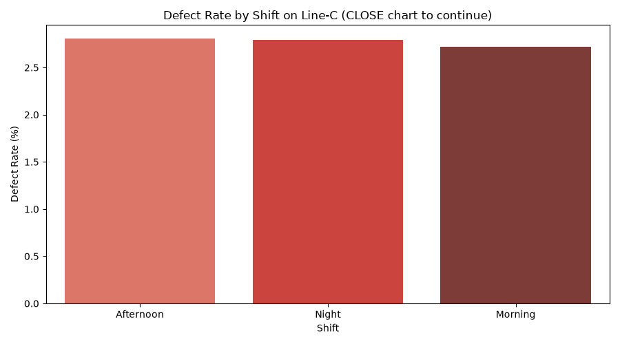
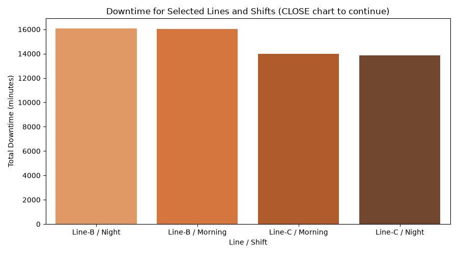
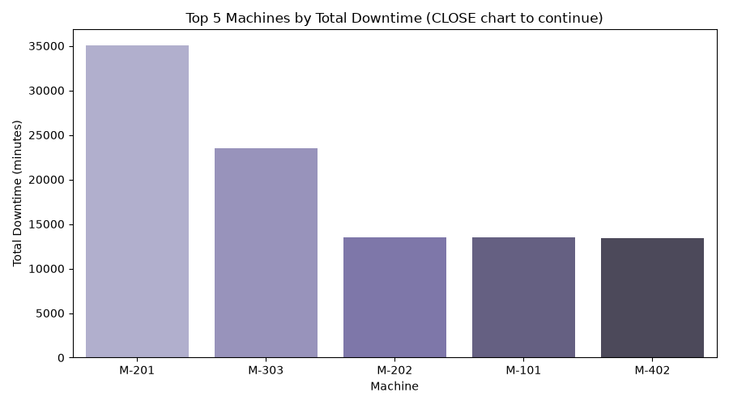
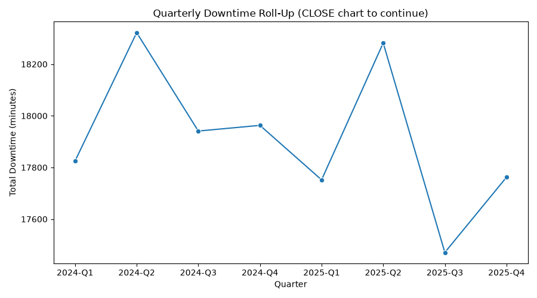
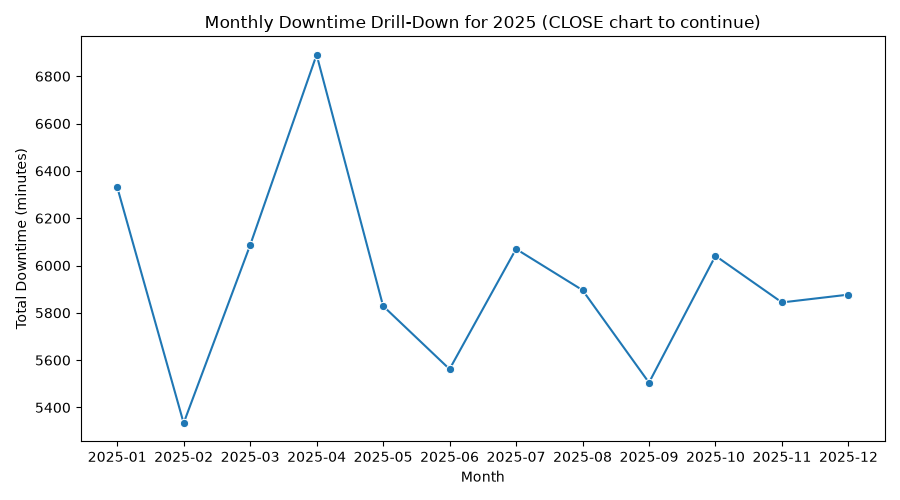

# bintel-05-reporting

[](https://denisecase.github.io/pro-analytics-02/workflow-b-apply-example-project/)
[](./pyproject.toml)
[](./LICENSE)

> Professional Python project: OLAP reporting on smart sales data,
> extended with a custom manufacturing process engineering analysis.

## Project Description

This project focuses on querying a DuckDB data warehouse using
OLAP operations to generate business intelligence reports.

The project includes a pre-populated data warehouse used for the example.
For your custom project, you are encouraged to use the warehouse
you created in the earlier project.
You can use this one if challenges remain with the earlier project.

We learn to:

- connect to a DuckDB data warehouse for reporting
- create a reporting-ready dataset from fact and dimension tables
- **slice** data by selecting one value from a dimension
- **dice** data by selecting values across multiple dimensions
- **roll up** detailed data into broader summaries
- **drill down** from summary values to quarterly and monthly detail
- visualize OLAP results with clear business charts
- explore the same OLAP concepts using Power BI or Apache Spark

## My Work in This Repository

In addition to the original example, this repository includes two
of my own files:

### Phase 4: Technical Modification — `olap_abdelhafidh.py`

A copy of `olap_case.py` extended with a new **Top N Products**
OLAP operation. In addition to the original slice, dice, roll-up,
and drill-down, this version ranks individual products by total
sales and reports the single best-selling product overall.

```shell
uv run python -m bizintel.olap_abdelhafidh
```

Output is written to `data/reporting/sales_reporting_abdelhafidh.csv`
(separate from the original example's output, so both can exist
side by side).

### Phase 5: Custom Project — Manufacturing Process Engineering

A completely different business problem, using the same OLAP
technique (slice, dice, roll-up, drill-down, and a top-N ranking)
applied to synthetic manufacturing process data instead of retail
sales. This analyzes production output, defect rates, and machine
downtime across production lines, shifts, and machines.

**1. Generate the synthetic dataset (run once):**

```shell
uv run python generate_manufacturing_data.py
```

This creates `data/manufacturing/manufacturing_process_abdelhafidh.csv`.

**2. Run the analysis:**

```shell
uv run python -m bizintel.manufacturing_abdelhafidh
```

This answers questions a plant manager or process engineer would
actually ask:

- Which shift has the highest defect rate on our most
  problematic production line? (slice)
- How does downtime compare across selected lines and shifts? (dice)
- How does total downtime trend by quarter and year? (roll-up)
- Which months had the worst downtime in the most recent year? (drill-down)
- Which individual machines cause the most downtime overall,
  and should be prioritized for maintenance? (top-N)

Output is written to
`data/reporting/manufacturing_reporting_abdelhafidh.csv`.

## Working Files

You'll work with these areas:

- **artifacts/** - generated duckdb warehouse (original sales example)
- **data/reporting/** - reporting-ready data generated by the examples
- **data/manufacturing/** - raw synthetic data for my custom project
- **docs/** - project narrative and documentation
- **src/bizintel/** - `olap_case.py` and `app_case.py` are the
  original examples (run only, not modified); `olap_abdelhafidh.py`
  and `manufacturing_abdelhafidh.py` are my own files
- **pyproject.toml** - update authorship & links
- **zensical.toml** - update authorship & links

## Reporting (Operating System Specific)

Run the original DuckDB OLAP example:

```shell
uv run python -m bizintel.olap_case
```

Run my modified version with the Top N Products analysis:

```shell
uv run python -m bizintel.olap_abdelhafidh
```

Run my custom manufacturing project:

```shell
uv run python generate_manufacturing_data.py
uv run python -m bizintel.manufacturing_abdelhafidh
```

Then, follow the path by operating system:

- **Windows:** Load the generated reporting data into Power BI Desktop.
- **macOS or Linux:** Run the Apache Spark OLAP example.
- see more information below

## Instructions (pro-analytics-02)

Follow the
[step-by-step workflow guide](https://denisecase.github.io/pro-analytics-02/workflow-b-apply-example-project/)
to complete:

1. Phase 1. **Start & Run**
2. Phase 2. **Change Authorship**
3. Phase 3. **Read & Understand**
4. Phase 4. **Modify**
5. Phase 5. **Apply**

## Challenges

Challenges are expected.
Sometimes instructions may not quite match your operating system.
When issues occur, share screenshots, error messages, and details about what you tried.
Working through issues is part of implementing professional projects.

One real challenge I hit during Phase 4: Windows **Smart App Control**
blocked `uv`'s managed Python interpreter entirely
(`An Application Control policy has blocked this file`), which had
nothing to do with my code. I diagnosed it by testing multiple
interpreters directly, confirmed via a Windows Security notification
that it distrusted `uv`'s unsigned Python download specifically, and
resolved it by installing an officially signed Python 3.14 from
python.org and pointing `uv` at that trusted interpreter with
`uv venv --python "<path>"`.

## Success

After completing Phase 1. **Start & Run**,
you'll have your own GitHub project,
and running the example module will print out:

```shell
========================
Executed successfully!
========================
```

A new file `project.log` will appear in the root project folder.

## Command Reference

<details>
<summary>Show command reference</summary>

### In a machine terminal (open in your `Repos` folder)

After you get a copy of this repo in your own GitHub account,
open a machine terminal in your `Repos` folder:

```shell
# Replace username with YOUR GitHub username.
git clone https://github.com/AbdelhafidhMahouel/bintel-05-reporting

cd bintel-05-reporting
code .
```

### In a VS Code terminal

These are listed for convenience.
For best results, follow the detailed instructions in
[pro-analytics-02 guide](https://denisecase.github.io/pro-analytics-02/).

```shell
uv self update
uv python pin 3.14
uv lock --upgrade
uv sync --extra dev --extra docs --upgrade

uvx pre-commit install
uvx pre-commit autoupdate

git add -A
uvx pre-commit run --all-files
# repeat if changes were made
uvx pre-commit run --all-files

# OPTIONAL: run the main pipeline app
# This has been adjusted to call the functions
# from this module...we'll do this again later.
uv run python -m bizintel.app_case

# PART 1. EVERYONE: run the DuckDB OLAP reporting example
uv run python -m bizintel.olap_case

# MY MODIFICATION: run the extended version with Top N Products
uv run python -m bizintel.olap_abdelhafidh

# MY CUSTOM PROJECT: manufacturing process engineering analysis
uv run python generate_manufacturing_data.py
uv run python -m bizintel.manufacturing_abdelhafidh

# PART 2. macOS or Linux: run the Spark OLAP example
#  1.  Add PySpark with Spark SQL support dependency
uv add "pyspark[sql]"
#  2. Restore the environment
uv sync --extra dev --extra docs --upgrade
#  3. Run the spark example
uv run python -m bizintel.olap_spark_case

# PART 2. Windows: use Power BI Desktop
#  1. Open Power BI Desktop.
#  2. Select Home > Get data > Text/CSV.
#  3. Browse to your chosen file: e.g., for the example: data/reporting/sales_reporting_case.csv
#  4. Select Open.
#  5. Review the data preview, and then select Load.

# run common chores
uv run ruff format .
uv run ruff check . --fix
uv run python -m pyright
uv run python -m pytest
uv run python -m zensical build

# save progress
git add -A
git commit -m "update"
git push -u origin main
```

</details>

## Notes

- Use the **UP ARROW** and **DOWN ARROW** in the terminal to scroll through past commands.
- Use `CTRL+f` to find (and replace) text within a file.
- You do not need to add to or modify `tests/`. They are provided for example only.
- Many files are silent helpers. Explore as you like, but nothing is required.
- You do NOT need to understand everything; understanding builds naturally over time.

## Troubleshooting >>>

If you see something like this in your terminal: `>>>` or `...`
You accidentally started Python interactive mode.
It happens.
Press `Ctrl+c` (both keys together) or `Ctrl+Z` then `Enter` on Windows.

## Example Output — Original Example (`olap_case.py`)

```shell
| BI | ========================
| BI | SUMMARY
| BI | ========================
| BI | Slice: In East, the leading category is Office ($456,342.94)
| BI | Dice: The strongest selected combination is East / Electronics ($218,291.81)
| BI | Roll-up: Total sales across all years are $3,673,389.85
| BI | Drill-down: The strongest month in 2025 is 2025-05 ($369,056.60)
| BI | ========================
| BI | ANALYST NOTES:
| BI | Use slice to focus on one dimension value.
| BI | Use dice to investigate a selected multidimensional subset.
| BI | Use roll-up to move from detail to broader summaries.
| BI | Use drill-down to investigate the detail behind a summary.
| BI | ========================
| BI | CALL a function to show charts........
| BI | Closed DuckDB connection
| BI | Workflow complete
| BI | CLOSE chart windows to continue.
| BI | Terminate this process with CTRL+c as needed.
| BI | ========================
| BI | Executed successfully!
| BI | ========================
```

## Example Output — My Modification (`olap_abdelhafidh.py`)

```shell
| BI | ========================
| BI | SUMMARY
| BI | ========================
| BI | Slice: In East, the leading category is Office ($456,342.94)
| BI | Dice: The strongest selected combination is East / Electronics ($218,291.81)
| BI | Roll-up: Total sales across all years are $3,673,389.85
| BI | Drill-down: The strongest month in 2025 is 2025-05 ($369,056.60)
| BI | Top Product: The best-selling product overall is Office-Recent (Office), ($259,512.53)
| BI | ========================
| BI | ANALYST NOTES:
| BI | Use slice to focus on one dimension value.
| BI | Use dice to investigate a selected multidimensional subset.
| BI | Use roll-up to move from detail to broader summaries.
| BI | Use drill-down to investigate the detail behind a summary.
| BI | Use a top-N ranking to identify leading individual performers.
| BI | ========================
| BI | Executed successfully!
| BI | ========================
```

## Example Output — My Custom Project (`manufacturing_abdelhafidh.py`)

```shell
| BI | ========================
| BI | SUMMARY
| BI | ========================
| BI | Slice: On Line-C, the Afternoon shift has the highest defect rate (2.81%)
| BI | Dice: The most downtime among selected combinations is Line-B / Night (16,090 minutes)
| BI | Roll-up: Total downtime across all time is 143,318 minutes
| BI | Drill-down: The worst month for downtime in 2025 is 2025-04 (6,891 minutes)
| BI | Top Machine: The machine causing the most downtime overall is M-201 on Line-B (35,086 minutes)
| BI | ========================
| BI | ENGINEER NOTES:
| BI | Use slice to focus on one production line.
| BI | Use dice to compare a targeted subset of lines and shifts.
| BI | Use roll-up to move from daily detail to broader summaries.
| BI | Use drill-down to investigate the detail behind a summary.
| BI | Use a top-N ranking to prioritize maintenance attention.
| BI | ========================
| BI | Executed successfully!
| BI | ========================
```

## Findings and Visuals

### Original Example & My Modification







The original example shows Office as the leading product category in
the East region, and East/Electronics as the strongest region-category
combination. My added Top N Products chart goes one level deeper,
showing that no single product dominates — the top 5 products are all
within about $20K of each other, suggesting sales are fairly evenly
spread across the best sellers rather than concentrated in one hit
product.

### My Custom Project: Manufacturing Process Engineering







The clearest finding is the Top 5 Machines chart: one machine, M-201
on Line-B, causes almost 50% more downtime than the next-worst
machine (M-303), and roughly 2.5x more than the rest of the top 5.
This is exactly the kind of insight a maintenance team could act on
directly — prioritize M-201 for inspection or replacement before
addressing the others.

## Project Documentation

Additional project instructions, terms, and notes:

[docs/index.md](docs/index.md)

## Citation

[CITATION.cff](./CITATION.cff)

## License

[MIT](./LICENSE)
